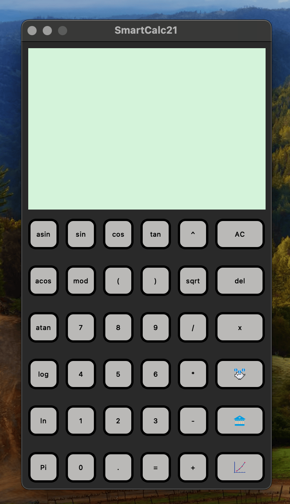
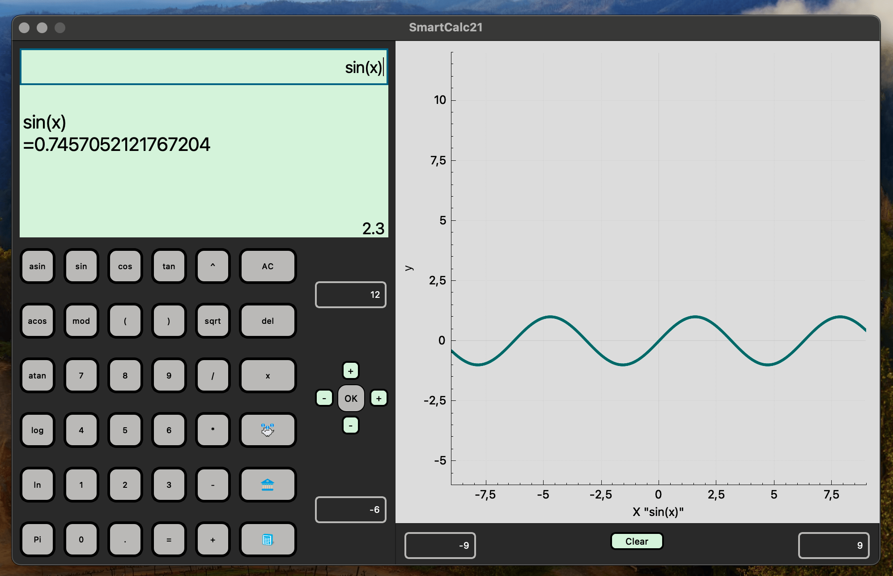
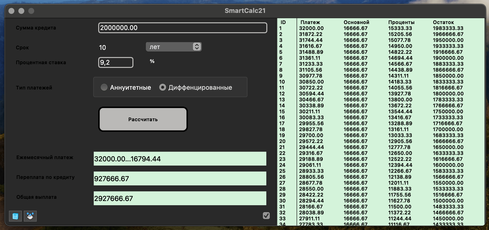

# SmartCalc v2.0

## Введение

SmartCalc v2.0
Основная часть проекта написана на языке С++, + визуальная составляющая Qt(C++) 
Информация находящаяся в этом файле поможет:

* 	 	собрать проект 
* 		провести UNIT-тестирование проекта

## Требования к системе
* установленная библиотека Qt
* установленная библиотека GTest
* doxigen
* Cmake

## Собираем проект
1. Заходим в директорию src/
	
2. Makefile: 
	* **all:** установка SmartCalc21 
	* **SmartCalc:** собирает SmartCalc.a
	* **test:**  собирает и запускает тесты	
	* **install:**  установка SmartCalc21 в ../build_SmartCalc21/ 
	* **uninstall:** удаление /build_SmartCalc21/ и её содержимого
	* **dist:** создает архив `Archive_SmartCalc21_v2.0` из содержимого которого можно собрать проект */../файлы необходимые для сборки исполняемого файла* `SmartCalc21`
	* **dist_clean:** удалает `Archive_SmartCalc21_v2.0.tgz`
	* **dvi:** открывает этот файл, создает  документацию через doxygen и открывает ее в браузере
	* **gcov_report:** запускает тестирование и создает html отчет о покрытии кода
	* **open:** открывает отчет о покрытии кода созданный целью *gcov_report*
	* **clang:** проверка сс файлов на стиль 
	* **leak:**	запуск тестов с valgrind or leaks
	* **clean:** удаление объектных, исполняемых файлов, файлов отчета .o .a .info .lox .tex
	* **clean_all:** clean + uninstall + dist_clean

		

		

		

